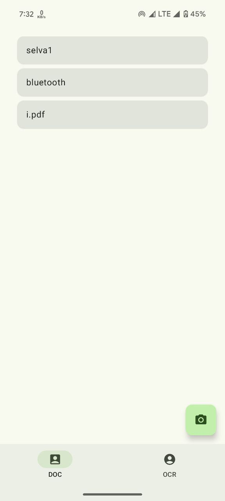
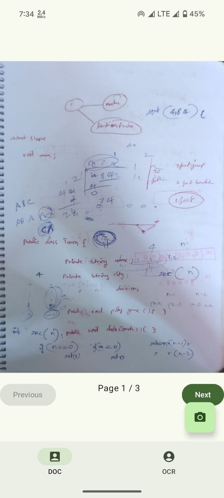
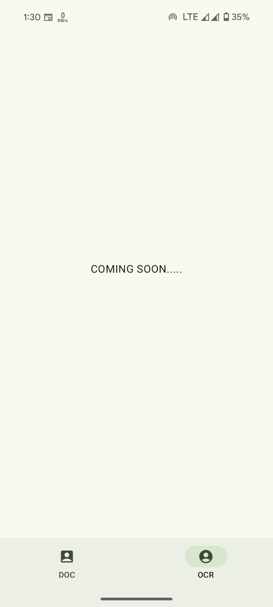
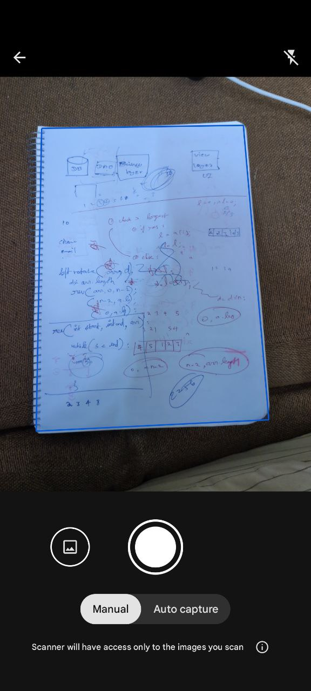
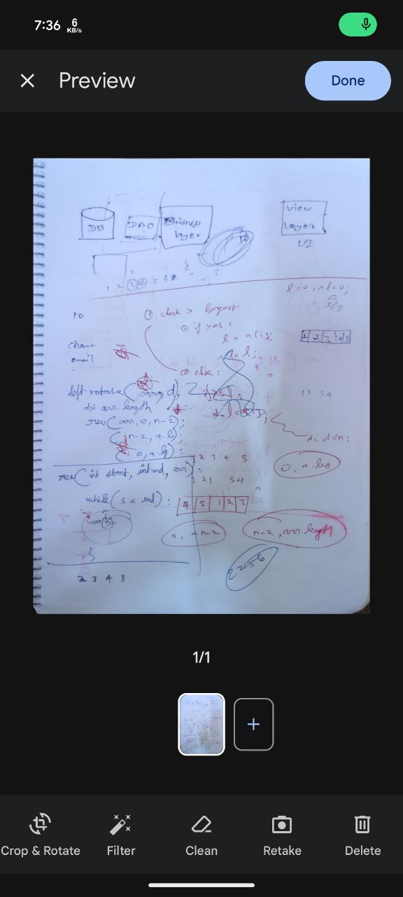

# Document Scanner App using ML Kit (UNDER WORK...)

This Android application provides a seamless document scanning experience using Google's ML Kit Document Scanning API. The app allows users to scan documents using their device's camera and saves the scanned results as PDFs, making it ideal for digitizing physical documents. The core functionality includes:

**Document Scanning with ML Kit:** Utilizes Google's ML Kit for document scanning, supporting both PDF and image formats. The user can scan documents directly from the camera or import them from the gallery.

**Dynamic Navigation with Jetpack Compose:** The app employs dynamic navigation for managing different screens. Each screen, like the document scanning screen and the document list screen, is independently managed with its own navigation host, ensuring smooth and intuitive user flow.

**PDF Management with Room Database:** The scanned PDFs are stored in a Room database for future access. The app uses PDFRenderer to display the first page as a preview, and on selecting a document, the full PDF can be viewed.

**Modern UI Design:** Jetpack Compose is used for a modern, responsive UI, ensuring a fluid user experience across different device sizes.

This project demonstrates the use of dynamic navigation patterns and Google's ML Kit for creating a practical document scanner app that stores, previews, and displays PDF documents efficiently.

# Screen Shots :

## Mobile potrait :
- Scanned Pdf Listing Screen :
  
  
  
- Pdf Detail Screen:
  
  
  
- Optical Character Recognition (OCR) Screen:
  
  
  
- Page Scanning Screen :

  
  
- Pdf Editing Screen :
  
  

## Mobile landscape :
